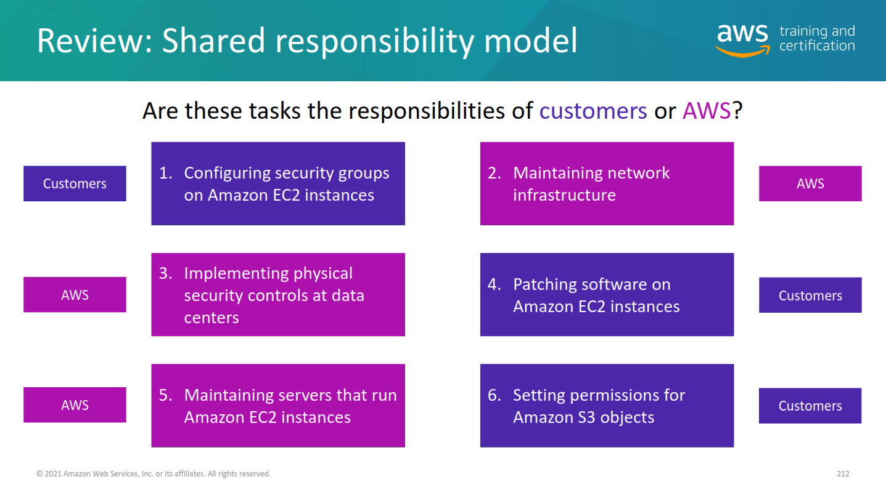

# MODUL 1: PENGANTAR AMAZON WEB SERVICE
## Model deployment untuk komputasi cloud

Tiga model deployment komputasi cloud terkait adalah model berbasis cloud, on-premise, dan hybrid :

## Deployment berbasis cloud
- Menjalankan semua bagian aplikasi di cloud.
- Memigrasi aplikasi yang ada ke cloud.
- Mendesain dan membangun aplikasi baru di cloud.  
  
Dalam model model deployment berbasis cloud, Anda dapat memigrasi aplikasi yang ada ke cloud, atau Anda dapat mendesain dan membangun aplikasi baru di cloud. Anda dapat membangun aplikasi tersebut pada infrastruktur tingkat rendah yang mengharuskan staf TI mengelolanya. Atau, Anda dapat membangunnya menggunakan layanan dengan tingkat lebih tinggi yang mengurangi persyaratan manajemen, arsitektur, dan penyesuaian skala infrastruktur inti.
  
Misalnya, perusahaan dapat membuat aplikasi yang terdiri dari server virtual, basis data, dan komponen jaringan yang sepenuhnya berbasis cloud.  

## Penerapan on-premise
- Men-deploy sumber daya menggunakan alat virtualisasi dan manajemen sumber daya.
- Meningkatkan pemanfaatan sumber daya menggunakan teknologi manajemen aplikasi dan virtualisasi.  
  
Deployment on-premise juga dikenal sebagai deploymentcloud privat. Dalam model ini, sumber daya di-deploy secara on-premise menggunakan alat virtualisasi dan manajemen sumber daya.
  
Misalnya, Anda mungkin memiliki aplikasi yang berjalan dengan teknologi yang hanya digunakan di pusat data on-premise Anda. Meskipun mirip dengan infrastruktur TI legacy, teknologi manajemen aplikasi dan virtualisasi pada model ini membantu meningkatkan pemanfaatan sumber daya.

## Penerapan hybrid
- Menghubungkan sumber daya berbasis cloud ke infrastruktur on-premise.
- Mengintegrasikan sumber daya berbasis cloud dengan aplikasi TI legacy.
  
Dalam deployment hibrida, sumber daya berbasis cloud terhubung ke infrastruktur on-premise. Anda dapat menggunakan pendekatan ini untuk sejumlah situasi. Misalnya, Anda memiliki aplikasi legacy yang lebih baik dikelola secara on-premise, atau peraturan pemerintah mewajibkan bisnis Anda untuk menyimpan dokumen tertentu secara on-premise.
  
Atau, misal sebuah perusahaan ingin menggunakan layanan cloud yang dapat mengotomatiskan pemrosesan data batch dan analitik. Namun, perusahaan itu memiliki beberapa aplikasi legacy yang lebih cocok dikelola secara on-premise dan tidak ingin melakukan migrasi ke cloud. Dengan deployment hibrida, perusahaan itu akan mampu mempertahankan aplikasi legacy secara on-premise sekaligus memperoleh keuntungan dari layanan data dan analitik yang berjalan di cloud.

## Keuntungan komputasi cloud
- Transaksikan biaya di muka untuk biaya variabel **(Trade upfront expense for variable expense)**  
  Biaya di muka mengacu pada pusat data, server fisik, dan sumber daya lain yang Anda perlu investasikan sebelum menggunakannya. Biaya variabel berarti Anda hanya membayar sumber daya komputasi yang digunakan daripada membayar banyak untuk pusat data dan server tanpa tahu lebih dahulu bagaimana Anda akan menggunakannya. Dengan mengambil pendekatan komputasi cloud yang menawarkan keuntungan biaya variabel, perusahaan dapat melakukan solusi inovatif sambil menghemat biaya.

- Berhenti mengeluarkan uang untuk menjalankan dan memelihara pusat data **Stop spending money to run and maintain data centers**  
  Komputasi di pusat data seringkali membuat Anda terpaksa menghabiskan lebih banyak uang dan waktu untuk mengelola infrastruktur dan server. Keuntungan komputasi cloud adalah adanya kemampuan untuk meringankan tugas-tugas ini dan lebih berfokus pada aplikasi dan pelanggan Anda.

- Berhenti menebak-nebak kapasitas **(Stop guessing capacity)**  
  Dengan komputasi cloud, Anda tidak perlu memprediksi berapa banyak kapasitas infrastruktur yang Anda perlukan sebelum men-deploy aplikasi.Misalnya, Anda dapat meluncurkan instans Amazon EC2 bila diperlukan, dan hanya membayar waktu komputasi yang Anda gunakan. Alih-alih membayar sumber daya yang tidak terpakai atau harus berurusan dengan kapasitas terbatas, Anda hanya dapat mengakses kapasitas yang Anda butuhkan. Anda juga dapat menaikkan atau menurunkan skala sebagai respons terhadap permintaan.

- Memperoleh manfaat dari efisiensi yang masif **(Benefit from massive economies of scale)**  
  Dengan menggunakan komputasi cloud, Anda dapat memperoleh biaya variabel yang lebih rendah dibandingkan dengan yang bisa Anda dapatkan sendiri. 
  Karena ratusan ribu penggunaan pelanggan dapat disatukan di cloud, penyedia, seperti AWS, dapat diuntungkan berkat efisiensi yang lebih tinggi. Manfaat efisiensi teruwujud dalam harga sesuai pemakaian yang lebih rendah.

- Meningkatkan kecepatan dan ketangkasan **(Increase speed and agility)**  
  Fleksibilitas komputasi cloud mempermudah Anda untuk mengembangkan dan men-deploy aplikasi.Fleksibilitas ini memberi Anda lebih banyak waktu untuk bereksperimen dan berinovasi. Saat melakukan komputasi di pusat data, diperlukan waktu berminggu-minggu untuk mendapatkan sumber daya baru yang Anda butuhkan. Sebagai perbandingan, komputasi cloud memungkinkan Anda mengakses sumber daya baru dalam hitungan menit.

- Merambah dunia global dalam hitungan menit **(Go global in minutes)**  
  Jejak global AWS Cloud memungkinkan Anda men-deploy aplikasi ke pelanggan di seluruh dunia dengan cepat, sekaligus memberi mereka latensi rendah. Artinya, sekalipun Anda berada di bagian dunia yang berbeda dengan pelanggan Anda, pelanggan dapat mengakses aplikasi Anda dengan penundaan minimal. 
  Kemudian dalam kursus ini, Anda akan mengeksplorasi infrastruktur global AWS secara lebih terperinci. Anda akan mempelajari beberapa layanan yang dapat digunakan untuk mengirimkan konten kepada pelanggan di seluruh dunia.

# MODUL 2: MELAKUKAN KOMPUTASI CLOUD
## Amazon Elastic Compute Cloud (Amazon EC2)
Jenis Instans Amazon EC2 :
- Instans tujuan umum **(General purpose instances)**  
  Instans tujuan umum memberikan keseimbangan sumber daya komputasi, memori, dan jaringan. Anda dapat menggunakannya untuk berbagai beban kerja, seperti:
  - server aplikasi
  - server game
  - server backend untuk aplikasi perusahaan
  - basis data kecil dan menengah  
   
  Misalkan Anda memiliki aplikasi dengan kebutuhan sumber daya untuk komputasi, memori, dan jaringan yang kurang lebih sama. Anda mungkin terpikir untuk menjalankannya pada instans tujuan umum karena aplikasi tidak memerlukan optimalisasi di setiap area sumber daya tunggal.

- Instans komputasi dioptimalkan **(Compute optimized instances)**  
  Instans Komputasi yang dioptimalkan ideal untuk aplikasi terikat komputasi yang memanfaatkan prosesor berkinerja tinggi. Seperti halnya instans tujuan umum, Anda dapat menggunakan instans komputasi yang dioptimalkan untuk beban kerja seperti web, aplikasi, dan server game.
  
  Namun, perbedaannya adalah aplikasi komputasi yang dioptimalkan ideal untuk server web kinerja tinggi, server aplikasi dengan komputasi yang intensif, dan server game khusus. Anda juga dapat menggunakan instans komputasi yang dioptimalkan untuk beban kerja pemrosesan batch yang memerlukan pemrosesan banyak transaksi dalam satu kelompok.

- Instans memori dioptimalkan **(Memory optimized instances)**  
  Instans memori yang dioptimalkan dirancang untuk memberikan kinerja cepat untuk beban kerja yang memproses kumpulan data besar dalam memori. Dalam komputasi, memori adalah area penyimpanan sementara. Memori ini menyimpan semua data dan instruksi sehingga unit pemrosesan pusat (CPU) harus dapat menyelesaikan tindakan. Sebelum program komputer atau aplikasi dapat berjalan, ia dipindahkan dari penyimpanan ke dalam memori. Proses pramuat ini memberikan CPU akses langsung ke program komputer.
  
  Misalkan Anda memiliki beban kerja yang membutuhkan sejumlah besar data yang akan dimuat sebelum menjalankan aplikasi. Skenario ini mungkin berupa basis data berkinerja tinggi atau beban kerja yang melibatkan pemrosesan waktu nyata dari sejumlah besar data tidak terstruktur. Dalam jenis kasus penggunaan ini, pertimbangkan untuk menggunakan instans memori yang dioptimalkan. Instans memori yang dioptimalkan memungkinkan Anda untuk menjalankan beban kerja dengan kebutuhan memori tinggi dan menerima kinerja yang hebat.

- Instans komputasi terakselerasi **(Accelerated computing instances)**  
  Instans komputasi yang dipercepat menggunakan akselerator perangkat keras, atau koprosesor, untuk melakukan beberapa fungsi dengan lebih efisien daripada yang bisa dilakukan dalam perangkat lunak yang beroperasi pada CPU. Contoh fungsi-fungsi ini mencakup kalkulasi angka floating-point, pengolahan grafis, dan pencocokan pola data.
  
  Dalam komputasi, akselerator perangkat keras adalah komponen yang dapat mempercepat pemrosesan data. Instans komputasi yang dipercepat sangat ideal untuk beban kerja seperti aplikasi grafis, streaming game, dan streaming aplikasi.

- Instans penyimpanan dioptimalkan **(Storage optimized instances)**  
  Instans penyimpanan yang dioptimalkan dirancang untuk beban kerja yang memerlukan pembacaan tinggi berurutan dan menulis akses ke kumpulan data yang sangat besar pada penyimpanan lokal. Contoh beban kerja yang cocok untuk instans penyimpanan yang dioptimalkan mencakup sistem file terdistribusi, aplikasi gudang data, dan sistem pemrosesan transaksi online frekuensi tinggi (OLTP). Dalam komputasi, istilah operasi input/output per detik (IOPS) adalah metrik yang mengukur kinerja perangkat penyimpanan. Hal ini menunjukkan berapa banyak operasi input atau output berbeda yang dapat dilakukan oleh perangkat dalam satu detik. Instans penyimpanan yang dioptimalkan dirancang untuk menghadirkan puluhan ribu IOPS latensi rendah dan acak ke aplikasi. 
  
  Anda dapat membayangkan operasi input sebagai data yang dimasukkan ke dalam sistem, misalnya catatan yang dimasukkan ke dalam basis data. Operasi output adalah data yang dihasilkan oleh server. Contoh output mungkin adalah analisis yang dilakukan pada catatan dalam basis data. Jika Anda memiliki aplikasi yang memiliki persyaratan IOPS tinggi, instans penyimpanan yang dioptimalkan dapat memberikan kinerja yang lebih baik daripada jenis instans lain yang tidak dioptimalkan untuk jenis kasus penggunaan ini.

## Penetapan harga Amazon EC2
- Sesuai permintaan **On Demand**  
  Instans Sesuai Permintaan ideal untuk jangka pendek, beban kerja tidak teratur yang tidak dapat terganggu. Tidak ada biaya di muka atau kontrak minimum berlaku. Instans beroperasi tanpa henti sampai Anda menghentikannya, dan Anda hanya membayar berdasarkan waktu komputasi yang Anda gunakan.
  
  Contoh kasus penggunaan untuk Instans Sesuai Permintaan mencakup pengembangan dan pengujian aplikasi serta pengoperasian aplikasi yang memiliki pola penggunaan tak terduga. Instans Sesuai Permintaan tidak disarankan untuk beban kerja yang berlangsung selama satu tahun atau lebih karena beban kerja ini dapat mengalami penghematan biaya yang lebih besar dengan Reserved Instances.

- Savings Plans Amazon EC2 **Amazon EC2 Savings Plans**  
  AWS menawarkan Savings Plans untuk beberapa layanan komputasi, termasuk Amazon EC2. Amazon EC2 Savings Plans memungkinkan Anda mengurangi biaya komputasi dengan berkomitmen bahwa jumlah penggunaan komputasi akan konsisten dalam jangka waktu 1 tahun atau 3 tahun. Komitmen jangka waktu ini menghasilkan penghematan hingga 72% dari biaya Sesuai Permintaan.
  
  Setiap penggunaan sampai dengan komitmen dibebankan pada tarif Savings Plan diskon (misalnya, 10 USD per jam). Setiap penggunaan di luar komitmen dibebankan dengan tarif Sesuai Permintaan biasa.
  
  Kemudian dalam kursus ini, Anda akan meninjau AWS Cost Explorer, alat yang memungkinkan Anda untuk memvisualisasikan, memahami, dan mengelola biaya AWS Anda dan penggunaan dari waktu ke waktu. Jika Anda ingin memilih Savings Plans, AWS Cost Explorer dapat menganalisis penggunaan Amazon EC2 Anda selama 7, 30, atau 60 hari yang lalu. AWS Cost Explorer juga menyediakan rekomendasi yang disesuaikan untuk Savings Plans. Rekomendasi ini memperkirakan besarnya penghematan biaya Amazon EC2 bulanan Anda, berdasarkan penggunaan Amazon EC2 sebelumnya dan jumlah komitmen per jam dalam Savings Plan 1 tahun atau 3 tahun.

- Instans Terpesan **(Reserved Instances)**  
  Instans Terpesan adalah diskon penagihan yang diterapkan pada penggunaan Instans Sesuai Permintaan di akun Anda. Anda dapat membeli Instans Terpesan Standar dan Instans Terpesan Konvertibel untuk jangka waktu 1 tahun atau 3 tahun, dan Instans Terpesan Terjadwal untuk jangka waktu 1 tahun. Anda menyadari penghematan biaya yang lebih besar dengan opsi 3 tahun.
  
  Pada akhir jangka waktu Instans Terpesan, Anda dapat terus menggunakan instans Amazon EC2 tanpa gangguan. Namun, Anda akan dikenakan tarif Sesuai Permintaan sampai Anda melakukan salah satu hal berikut ini:
  - Menghentikan instans.
  - Membeli Instans Terpesan baru yang cocok dengan atribut instans (jenis instans, Wilayah, sewa, dan platform).

- Instans Spot **(Spot Instances)**  
  Instans Spot sangat cocok untuk beban kerja dengan waktu mulai dan akhir yang fleksibel, atau yang dapat menahan gangguan. Instans Spot menggunakan kapasitas komputasi Amazon EC2 yang tidak terpakai dan menawarkan penghematan biaya hingga 90% atas harga Sesuai Permintaan.
  
  Sekiranya Anda mempunyai tugas pemrosesan latar belakang yang dapat memulai dan berhenti sesuai kebutuhan (seperti tugas pemrosesan data untuk survei pelanggan). Anda ingin memulai dan menghentikan pekerjaan pemrosesan tanpa memengaruhi keseluruhan operasi bisnis Anda. Jika Anda membuat permintaan Spot dan kapasitas Amazon EC2 tersedia, Instans Spot Anda akan diluncurkan. Namun, jika Anda membuat permintaan Spot dan kapasitas Amazon EC2 tidak tersedia, permintaan tidak berhasil sampai kapasitas tersebut tersedia. Kapasitas yang tidak tersedia dapat menunda peluncuran pekerjaan pemrosesan latar belakang Anda.
  
  Setelah Anda meluncurkan Instans Spot, jika kapasitas tidak lagi tersedia atau permintaan untuk Instans Spot meningkat, instans Anda mungkin terganggu. Hal ini mungkin tidak menimbulkan masalah apa pun untuk pekerjaan pemrosesan latar belakang Anda. Namun, pada contoh awal pengembangan dan pengujian aplikasi, kemungkinan besar Anda ingin menghindari gangguan yang tidak terduga. Oleh karenanya, pilih jenis instans EC2 yang berbeda yang ideal untuk tugas-tugas tersebut.

- Host Khusus **(Dedicated Hosts)**  
  Host Khusus adalah server fisik dengan kapasitas instans Amazon EC2 yang dirancang khusus untuk kebutuhan Anda. 
  
  Anda dapat menggunakan lisensi perangkat lunak per-soket, per-inti, atau per-VM yang ada untuk membantu memelihara kepatuhan lisensi. Anda dapat membeli Host Khusus Sesuai Permintaan dan Pemesanan Host Khusus Dari semua pilihan Amazon EC2 yang tercakup, Host Khusus adalah yang paling mahal.

## Perbedaaan antara saving plans Amazon EC2 dan instans spot
- Saving Plans Amazon EC2
  Sangat cocok untuk workload yang melibatkan jumlah penggunaan komputasi yang konsisten selama jangka waktu 1 tahun atau 3 tahun.

  Dengan saving plans amazon ec2, anda dapat mengurangi biaya komputasi 72% atas biaya sesuai permintaan.

- Instans Spot
  Sangat cocok untuk workload dengan waktu yang fleksibel, atau yang dapat menahan gangguan. Dengan Instans Spot, anda dapat mengurangi biaya komputasi hingga 90% dari biaya komputasi hingga 90% dari biaya sesuai permintaan.

  Tidak seperti Saving Plans Amazon EC2. Instans spot tidak memerlukan kontrak atau komitmen untuk jumlah penggunaan komputasi yang konsisten.

## Elastic Load Balancing
Elastis Load Balancing adalah layanan AWS yang secara otomatis mendistribusikan lalu lintas aplikasi masuk di beberapa sumber daya, seperti Instans Amazon EC2. 

Load balancer berfungsi sebagai titik kontak tunggal untuk semua lalu lintas masuk ke dalam Grup Auto Scaling. Artinya, saat Anda menambahkan atau menghapus instans Amazon EC2 dalam merespons jumlah lalu lintas masuk, tindakan ini meminta rute ke load balancer terlebih dahulu. Kemudian, permintaan tersebar di beberapa sumber daya yang akan menanganinya. Misalnya, jika Anda memiliki beberapa instans Amazon EC2, Elastic Load Balancing mendistribusikan workload di beberapa instans sehingga tidak ada instans tunggal yang harus membawanya dalam jumlah besar. 

Meskipun Elastic Load Balancing dan Amazon EC2 Auto Scaling adalah layanan terpisah, keduanya bekerja sama untuk memastikan bahwa aplikasi yang berjalan di Amazon EC2 dapat memberikan kinerja tinggi dan ketersediaan. 

## Amazon Simple Notification Service (Amazon SNS)
Amazon Simple Notification Service (Amazon SNS) adalah layanan publikasi/berlangganan. Dengan menggunakan topik Amazon SNS, penerbit menerbitkan pesan kepada pelanggan. Hal ini mirip dengan kedai kopi; kasir memberikan pesanan kopi untuk barista yang membuat minuman.

Di Amazon SNS, pelanggan dapat berupa server web, alamat email, fungsi AWS Lambda, atau beberapa pilihan lainnya. 

## Amazon Simple Queue Service (Amazon SQS)
Amazon Simple Queue Service (Amazon SQS) adalah layanan antrean pesan.

Dengan menggunakan SQS, Anda dapat mengirim, menyimpan, dan menerima pesan antara komponen perangkat lunak, tanpa kehilangan pesan atau memerlukan layanan lain agar pesan tersedia. Di Amazon SQS, aplikasi mengirim pesan ke antrean. Pengguna atau layanan mengambil pesan dari antrean, memprosesnya, kemudian menghapusnya dari antrean.

## Amazon Lambda
AWS Lambda adalah layanan yang memungkinkan Anda menjalankan kode tanpa perlu menyediakan atau mengelola server. 

Saat menggunakan AWS Lambda, Anda cukup membayar untuk waktu komputasi yang Anda konsumsi. Biaya dikenakan hanya ketika kode Anda berjalan. Anda dapat menjalankan kode hampir untuk semua jenis aplikasi atau layanan backend – semua tanpa administrasi. 

Misalnya, fungsi Lambda sederhana mungkin melibatkan pengubahan ukuran gambar yang diunggah secara otomatis ke AWS Cloud. Dalam hal ini, fungsi memicu proses saat mengunggah gambar baru. 

## Amazon Elastic Container Service (Amazon ECS)
Amazon Elastic Container Service (Amazon ECS) adalah sistem manajemen kontainer berkinerja sangat baik dengan skalabilitas yang tinggi, yang memungkinkan Anda untuk menjalankan dan menskalakan aplikasi dalam kontainer pada AWS. 

Amazon ECS mendukung kontainer Docker. Docker adalah platform perangkat lunak yang memungkinkan Anda membuat, menguji, dan men-deploy aplikasi dengan cepat. AWS mendukung penggunaan Docker Community Edition open source dan Docker Enterprise Edition berbasis langganan. Dengan Amazon ECS, Anda dapat menggunakan panggilan API untuk meluncurkan dan menghentikan aplikasi bertenaga Docker.

## Amazon Elastic Kubernetes Service (Amazon EKS)
Amazon Elastic Kubernetes Service (Amazon EKS) adalah layanan yang sepenuhnya dikelola yang dapat Anda gunakan untuk menjalankan Kubernetes pada AWS. 

Kubernetes adalah perangkat lunak open source yang memungkinkan Anda men-deploy dan mengelola aplikasi yang terkemas sesuai skala. Sebuah komunitas sukarelawan yang besar selama ini memelihara Kubernetes dan AWS secara aktif bekerja sama dengan mereka. Jika ada fitur dan fungsionalitas baru dirilis untuk aplikasi Kubernetes, Anda dapat dengan mudah menerapkan pembaruan ini untuk aplikasi yang dikelola oleh Amazon EKS.

## AWS Fargate
AWS Fargate adalah mesin komputer nirserver untuk kontainer. Mesin ini bekerja dengan Amazon ECS dan Amazon EKS. 

Bila menggunakan AWS Fargate, Anda tidak perlu menyediakan atau mengelola server. AWS Fargate mengelola infrastruktur server untuk Anda. Anda dapat lebih berfokus pada inovasi dan pengembangan aplikasi Anda, dan Anda hanya membayar untuk sumber daya yang diperlukan untuk menjalankan kontainer Anda.

# Modul 3: GLOBAL INFRASTUCTURE AND RELIABILITY
## Infrastuktur global AWS
Saat menentukan Region yang tepat untuk layanan, data, dan aplikasi Anda, pertimbangkan empat faktor bisnis berikut.
- Kepatuhan terhadap tata kelola data dan persyaratan hukum
- Kedekatan dengan pelanggan anda
- Layanan yang tersedia dalam region
- Harga

## Availability Zones
Availability Zone adalah pusat data tunggal atau sekelompok pusat data dalam suatu Region. Setiap Availability Zone terpisah puluhan mil dari yang lain. Jarak ini cukup dekat untuk menimbulkan latensi rendah (periode sejak konten diminta hingga konten diterima) di antara Availability Zone. Namun, jika terjadi bencana di salah satu bagian Region, jaraknya cukup jauh untuk mengurangi potensi dampak terhadap beberapa Availability Zones.

## Amazon CloudFront
Amazon CloudFront adalah layanan yang membantu mengirimkan data, video, aplikasi, dan API dengan latency rendah dan kecepatan transfer tinggi.

## Lokasi Edge
Lokasi edge adalah situs yang digunakan Amazon CloudFront untuk menyimpan salinan konten Anda di cache yang lebih dekat ke pelanggan Anda untuk pengiriman lebih cepat.

## AWS Outposts
AWS Outposts adalah layanan terkelola penuh yang memperluas infrastruktur, layanan, API, dan alat AWS untuk tempat pelanggan. Dengan menyediakan akses lokal ke infrastruktur yang dikelola, AWS Outposts memungkinkan pelanggan untuk membangun dan menjalankan aplikasi di lokasi menggunakan antarmuka pemrograman yang sama seperti di Wilayah, AWS sekaligus menggunakan sumber daya komputasi dan penyimpanan lokal untuk latensi yang lebih rendah dan kebutuhan pemrosesan data lokal.

Dengan AWS Outposts, Anda dapat menjalankan beberapa layanan AWS secara lokal dan menghubungkannya ke berbagai layanan yang tersedia di Wilayah AWS lokal. Jalankan aplikasi dan beban kerja on-premise menggunakan layanan, alat, dan API AWS yang sudah dikenal. Outposts mendukung beban kerja dan perangkat yang mengharuskan akses latensi rendah ke sistem on-premise, pemrosesan data lokal, residensi data, dan migrasi aplikasi yang memiliki interdependensi sistem lokal. 

## AWS Elastic Beanstalk
Dengan AWS Elastic Beanstalk, Anda menyediakan pengaturan kode serta konfigurasi, dan Elastic Beanstalk men-deploy sumber daya yang diperlukan untuk melakukan tugas berikut:
- Menyesuaikan kapasitas
- Menyeimbangkan beban
- Melakukan skala otomatis
- Memantau kesehatan aplikasi

## AWS CloudFormation
Dengan AWS CloudFormation, Anda dapat memperlakukan infrastruktur Anda sebagai kode. Artinya, Anda dapat membangun lingkungan dengan menulis baris kode alih-alih menggunakan AWS Management Console untuk sumber daya penyediaan secara individual.

AWS CloudFormation menyediakan sumber daya Anda dengan cara yang aman dan berulang, sehingga Anda dapat membangun infrastruktur dan aplikasi berkali-kali tanpa harus melakukan tindakan manual atau menulis skrip kustom. Hal ini menentukan operasi tepat yang perlu dijalankan ketika mengelola tumpukan Anda dan membatalkan perubahan secara otomatis jika mendeteksi kesalahan.

# MODUL 4: NETWORKING
## Amazon Virtual Private Cloud (Amazon VPC)
Sebuah layanan jaringan yang dapat Anda gunakan untuk menetapkan batas-batas di sekitar sumber daya AWS adalah Amazon Virtual Private Cloud (Amazon VPC).

Amazon VPC membantu Anda menyediakan bagian terisolasi dari AWS Cloud. Dalam bagian terisolasi ini, Anda dapat meluncurkan sumber daya dalam jaringan virtual yang Anda tetapkan. Dalam virtual private cloud (VPC), Anda dapat mengatur sumber daya Anda ke dalam subnet. Subnet adalah bagian dari VPC yang dapat berisi sumber daya seperti instans Amazon EC2.

## Internet Gateway
**Internet Gateway** adalah koneksi antara VPC dan internet. Anda bisa bayangkan, gateway internet seperti pintu yang digunakan oleh pelanggan untuk memasuki kedai kopi. Tanpa gateway internet, tidak ada yang dapat mengakses sumber daya dalam VPC Anda.

## Virtual Private Gateway
**Virtual private gateway** adalah komponen yang memberikan perlindungan terhadap lalu lintas internet saat masuk ke VPC. Meskipun koneksi Anda ke kedai kopi memiliki perlindungan ekstra, kemacetan lalu lintas mungkin terjadi karena Anda menggunakan jalan yang sama dengan pelanggan lain. 

Virtual private gateway membantu Anda membuat koneksi virtual private network (VPN) antara VPC dan jaringan pribadi, seperti pusat data on-premise atau jaringan perusahaan internal. Virtual private gateway membantu lalu lintas ke VPC hanya jika lalu lintas tersebut berasal dari jaringan yang disetujui.

## AWS Direct Connect
**AWS Direct Connect** adalah layanan yang membantu Anda untuk membangun koneksi pribadi khusus antara pusat data dan VPC.

Koneksi privat yang disediakan AWS Direct Connect membantu Anda mengurangi biaya jaringan dan meningkatkan jumlah bandwidth yang dapat melakukan perjalanan melalui jaringan Anda.

## Subnet
**Subnet** adalah bagian dari VPC tempat Anda dapat mengelompokkan sumber daya berdasarkan keamanan atau kebutuhan operasional. Subnet bisa bersifat publik atau pribadi. 
  - Public Subnet berisi sumber daya yang perlu diakses oleh publik, seperti situs web toko daring.
  - Private Subnet berisi sumber daya yang seharusnya hanya dapat diakses melalui jaringan pribadi Anda, seperti basis data yang berisi informasi pribadi pelanggan dan riwayat pesanan.

Dalam VPC, subnet dapat saling berkomunikasi. Misalnya, Anda mungkin memiliki aplikasi yang melibatkan instans Amazon EC2 di subnet publik yang berkomunikasi dengan basis data yang terletak di subnet pribadi.

## Network access control lists (ACLs) (Stateless packet filtering)
Komponen VPC yang memeriksa izin paket untuk subnet adalah access control list (ACL) jaringan.
Access control list (ACL) jaringan adalah firewall virtual yang mengontrol lalu lintas masuk dan keluar di tingkat subnet.

**Network access control lists are virtual firewalls for subnets. They perform stateless packet filtering.** 

## Security groups (Stateful packet filtering)
Grup keamanan adalah firewall virtual yang mengontrol lalu lintas masuk dan keluar untuk instans Amazon EC2.

Secara default, grup keamanan menolak semua lalu lintas masuk dan mengizinkan semua lalu lintas keluar. Anda dapat menambahkan aturan kustom untuk mengonfigurasi lalu lintas mana yang diizinkan atau ditolak.

Jika Anda memiliki beberapa instans Amazon EC2 dalam subnet, Anda dapat mengasosiasikan mereka dengan grup keamanan yang sama atau menggunakan grup keamanan yang berbeda untuk setiap instans. 

**Security groups are virtual firewall for Amazon EC2 instances. They perform stateful packet filtering.**

## Amazon Route 53
**Amazon Route 53** adalah layanan web DNS. Layanan ini memberi para developer dan bisnis sebuah metode andal untuk menujukan pengguna akhir ke aplikasi internet yang di-host di AWS.

Amazon Route 53 menghubungkan permintaan pengguna untuk infrastruktur yang berjalan di AWS (seperti instans Amazon EC2 dan load balancer). Hal ini dapat mengarahkan pengguna ke infrastruktur di luar AWS.

Fitur lain dari Route 53 adalah kemampuannya untuk mengelola catatan DNS untuk nama domain. Anda dapat mendaftarkan nama domain baru secara langsung di Route 53. Anda juga dapat mentransfer catatan DNS untuk nama domain yang ada yang dikelola oleh registrar domain lainnya. Hal ini memungkinkan Anda untuk mengelola semua nama domain dalam satu lokasi.

# MODUL 5: STORAGE DAN DATABASE
## Instance Store
**Penyimpanan instans** adalah penyimpanan disk yang secara fisik terpasang pada komputer host instans EC2, dan oleh karenanya memiliki masa pakai yang sama seperti instans. Saat instans dihentikan, semua data dalam penyimpanan instans Anda akan hilang.

## Amazon Block Storage (Amazon EBS)
**Amazon Elastic Block Store (Amazon EBS)** adalah layanan yang menyediakan volume penyimpanan tingkat blok yang dapat digunakan bersama instans Amazon EC2. Jika Anda menghentikan atau mengakhiri instans Amazon EC2, semua data pada volume EBS yang terpasang tetap tersedia.

Untuk membuat volume EBS, Anda menentukan konfigurasi (seperti ukuran volume dan jenis), lalu menyediakannya. Setelah Anda membuat volume EBS, volume dapat dipasang pada instans Amazon EC2.

Penting untuk mencadangkan data, sebab volume EBS digunakan bagi data yang perlu terus tersedia. Anda dapat menggunakan cadangan tambahan volume EBS dengan membuat snapshot Amazon EBS.

**Snapshot EBS** adalah cadangan tambahan. Ini berarti cadangan pertama yang diambil dari volume menyalin semua data. Untuk cadangan berikutnya, hanya blok data yang telah berubah sejak snapshot terakhir yang disimpan. 

Cadangan tambahan berbeda dari cadangan penuh, saat semua data dalam volume penyimpanan disalin setiap kali pencadangan dilakukan. Cadangan penuh mencakup data yang tidak berubah sejak pencadangan terakhir.

## Amazon Simple Storage Service (Amazon S3)
Dalam penyimpanan objek, setiap objek terdiri atas data, metadata, dan kunci.

Data dapat berupa gambar, video, dokumen teks, atau jenis file lainnya. Metadata berisi informasi tentang data tersebut, caranya digunakan, ukuran objek, dan sebagainya. Kunci objek adalah pengidentifikasi unik.

**Amazon Simple Storage Service (Amazon S3)** adalah layanan yang menyediakan penyimpanan tingkat objek. Amazon S3 menyimpan data sebagai objek dalam bucket.

Anda dapat mengunggah semua jenis file ke Amazon S3, seperti gambar, video, file teks, dan sebagainya. Misalnya, Anda dapat menggunakan Amazon S3 untuk menyimpan file cadangan, file media untuk situs web, atau dokumen yang diarsipkan. Amazon S3 menawarkan ruang penyimpanan tak terbatas. Ukuran file maksimum bagi objek dalam Amazon S3 adalah 5 TB.

Saat Anda mengunggah file ke Amazon S3, Anda dapat mengatur izin untuk mengontrol visibilitas dan aksesnya. Anda juga dapat menggunakan fitur versi Amazon S3 untuk melacak perubahan objek Anda dari waktu ke waktu.

### S3 Standard
- Dirancang untuk data yang sering diakses
- Menyimpan data dalam minimal tiga Availability Zone  

S3 Standard menghadirkan ketersediaan tinggi untuk objek. Ini menjadikannya pilihan yang bagus bagi berbagai kasus penggunaan, seperti situs web, distribusi konten, dan analitik data. S3 Standard biayanya lebih tinggi daripada kelas penyimpanan lain yang dimaksudkan untuk penyimpanan data dan arsip yang jarang diakses.

### S3 Standard-Infrequent Access (S3 Standard-IA)
- Ideal untuk data yang jarang diakses
- Serupa dengan S3 Standard, tetapi dengan harga penyimpanan lebih murah dan harga pengambilan yang lebih mahal  

S3 Standard-IA sangat cocok untuk data yang jarang diakses, tetapi memerlukan ketersediaan tinggi saat diperlukan. S3 Standard dan S3 Standard-IA menyimpan data dalam minimal tiga Availability Zone. S3 Standard-IA menyediakan tingkat ketersediaan yang sama seperti S3 Standard, tetapi dengan harga penyimpanan yang lebih murah dan harga pengambilan yang lebih mahal.

### S3 One Zone-Infrequent Access (S3 One Zone-IA)
- Menyimpan data dalam Availability Zone tunggal
- Dengan harga penyimpanan yang lebih murah daripada S3 Standard-IA  

Dibandingkan dengan S3 Standard dan S3 Standard-IA yang menyimpan data dalam minimal tiga Availability Zone, S3 One Zone-IA menyimpan data dalam satu Availability Zone. Ini menjadikannya kelas penyimpanan yang patut dipertimbangkan jika kondisi berikut berlaku:
- Anda ingin menghemat biaya penyimpanan.
- Anda dapat dengan mudah memperbanyak data jika terjadi kegagalan Availability Zone.

### S3 Intelligent-Tiering
- Ideal untuk data dengan pola akses yang tidak diketahui atau berubah
- Membutuhkan sedikit biaya pemantauan dan automasi bulanan per objek  

Dalam kelas penyimpanan S3-Intelligent-Tiering, Amazon S3 memantau pola akses objek. Jika Anda tidak mengakses objek selama 30 hari berturut-turut, Amazon S3 secara otomatis memindahkannya ke tingkat akses jarang, yaitu S3 Standard-IA. Jika Anda mengakses objek pada tingkat akses jarang, Amazon S3 secara otomatis memindahkannya ke tingkat akses sering, yaitu S3 Standard.

### S3 Glacier
- Penyimpanan berbiaya rendah yang dirancang untuk pengarsipan data
- Mampu mengambil objek dalam beberapa menit hingga beberapa jam  

S3 Glacier adalah kelas penyimpanan berbiaya rendah yang ideal untuk pengarsipan data. Misalnya, Anda dapat menggunakan kelas penyimpanan ini untuk menyimpan catatan pelanggan yang diarsipkan atau foto dan file video lama.

### S3 Glacier Deep Archive
- Kelas penyimpanan objek dengan biaya terendah yang ideal untuk pengarsipan
- Mampu mengambil objek dalam 12 jam  

Saat memutuskan antara Amazon S3 Glacier dan Amazon S3 Glacier Deep Archive, pertimbangkan seberapa cepat Anda perlu mengambil objek yang diarsipkan. Anda dapat mengambil objek yang disimpan dalam kelas penyimpanan S3 Glacier dalam beberapa menit hingga beberapa jam. Sebagai perbandingan, Anda dapat mengambil objek yang disimpan dalam kelas penyimpanan S3 Glacier Deep Archive dalam waktu 12 jam.

## Amazon Elastic File System (Amazon EFS)
**Amazon Elastic File System (Amazon EFS)** adalah sistem file terukur yang digunakan bersama layanan AWS Cloud dan sumber daya on-premise. Saat Anda menambahkan dan menghapus file, Amazon EFS secara otomatis membesar dan mengecil. Ini dapat diukur sesuai permintaan hingga petabyte tanpa mengganggu aplikasi. 

**Membandingkan Amazon EBS dan Amazon EFS**
Amazon EBS:
- Volume Amazon EBS menyimpan data dalam satu Availability Zone. 
- Untuk memasang instans Amazon EC2 ke volume EBS, instans Amazon EC2 dan volume EBS harus berada dalam Availability Zone yang sama.  

Amazon EFS:
- Amazon EFS adalah layanan regional. Layanan ini menyimpan data dalam dan di beberapa Availability Zone. 
- Penyimpanan duplikat memungkinkan Anda mengakses data secara bersamaan dari semua Availability Zone di Region tempat sistem file berada. Selain itu, server on-premise dapat mengakses Amazon EFS menggunakan AWS Direct Connect.
  
## Amazon Relational Database
**Amazon Relational Database Service (Amazon RDS)** adalah layanan yang memungkinkan Anda menjalankan basis data relasional di AWS Cloud.

Amazon RDS adalah layanan terkelola yang mengotomatiskan berbagai tugas, seperti penyediaan perangkat keras, pengaturan basis data, patching, dan pencadangan. Dengan kemampuan ini, Anda dapat mengurangi waktu menyelesaikan tugas administratif dan mencurahkan lebih banyak waktu menggunakan data demi inovasi aplikasi Anda. Anda dapat mengintegrasikan Amazon RDS dengan layanan lain untuk memenuhi kebutuhan bisnis dan operasional Anda, seperti menggunakan AWS Lambda untuk kueri basis data Anda dari aplikasi tanpa server.

Amazon RDS menyediakan sejumlah pilihan keamanan. Banyak mesin basis data Amazon RDS menawarkan enkripsi saat diam (melindungi data saat disimpan) dan enkripsi saat dalam transit (melindungi data saat sedang dikirimkan dan diterima).

Amazon RDS tersedia pada enam mesin basis data, yang dioptimalkan untuk memori, kinerja, atau input/output (I/O). Mesin basis data yang didukung meliputi:
- Amazon Aurora
- PostgreSQL
- MySQL
- MariaDB
- Oracle Database
- Microsoft SQL Server

## Amazon Aurora
Amazon Aurora adalah basis data relasional kelas perusahaan. Ini kompatibel dengan basis data relasional MySQL dan PostgreSQL. Hingga lima kali lebih cepat daripada basis data MySQL standar dan hingga tiga kali lebih cepat daripada basis data PostgreSQL standar.

Amazon Aurora membantu memangkas biaya basis data Anda dengan mengurangi operasi input/output (I/O) yang tidak perlu, sembari memastikan sumber daya basis data Anda tetap andal dan tersedia. 

Pertimbangkan Amazon Aurora jika workload Anda membutuhkan ketersediaan tinggi. Ini mereplikasi enam salinan data Anda di tiga Availability Zone dan terus mencadangkan data Anda ke Amazon S3.

## Amazon DynamoDB
**Amazon DynamoDB** adalah layanan basis data key-value. Layanan ini menghadirkan kinerja milidetik satu digit pada skala apa pun.

**Serverless**
- DynamoDB bekerja nirserver, yang berarti Anda tidak harus menyediakan, melakukan patch, atau mengelola server.
- Anda juga tidak perlu menginstal, memelihara, atau mengoperasikan perangkat lunak.

**Automatic Scaling**
- Selagi ukuran basis data Anda menyusut atau membesar, DynamoDB secara otomatis diskalakan untuk menyesuaikan perubahan kapasitas sembari mempertahankan kinerja yang konsisten. 
- Ini menjadikannya pilihan yang sesuai untuk kasus penggunaan yang memerlukan kinerja tinggi saat penskalaan.

## Amazon Redshift
Amazon Redshift adalah layanan gudang data yang dapat Anda gunakan untuk analitik big data. Layanan ini menawarkan kemampuan mengumpulkan data dari banyak sumber dan membantu Anda memahami hubungan dan tren di seluruh data Anda.

## AWS Database Migration Service (AWS DMS)
AWS Database Migration Service (AWS DMS) memungkinkan Anda untuk memigrasikan basis data relasional, basis data nonrelasional, dan jenis penyimpanan data lain.

Dengan AWS DMS, Anda memindahkan data antara basis data sumber dan basis data target. Basis data sumber dan target dapat berupa jenis yang sama atau berbeda. Selama migrasi, basis data sumber Anda tetap beroperasi, sehingga mengurangi waktu henti bagi aplikasi yang mengandalkan basis data. 

Misalnya, anggap saja Anda memiliki basis data MySQL yang disimpan secara on-premise pada instans Amazon EC2 atau di Amazon RDS. Anggap basis data MySQL sebagai basis data sumber Anda. Menggunakan AWS DMS, Anda dapat memigrasikan data ke basis data target, seperti basis data Amazon Aurora.

# MODUL 6: SECURITY
## The AWS shared responsibility model
Sepanjang kursus ini, Anda telah mempelajari berbagai sumber daya yang dapat dibuat di AWS Cloud. Sumber daya ini termasuk instans Amazon EC2, bucket Amazon S3, dan basis data Amazon RDS. Siapa yang bertanggung jawab untuk menjaga keamanan sumber daya ini: Anda (pelanggan) atau AWS?

Jawabannya adalah keduanya. Alasannya adalah bahwa Anda tidak memperlakukan lingkungan AWS sebagai objek tunggal. Sebaliknya, Anda memperlakukan lingkungan sebagai kumpulan bagian yang saling membangun. AWS bertanggung jawab atas beberapa bagian dari lingkungan Anda dan Anda (pelanggan) bertanggung jawab atas bagian lain. Konsep ini dikenal sebagai model tanggung jawab bersama.

Model tanggung jawab bersama terbagi menjadi tanggung jawab pelanggan (biasanya disebut sebagai “keamanan di cloud”) dan tanggung jawab AWS (biasanya disebut sebagai “keamanan cloud”).

**AWS: Keamanan cloud**
AWS bertanggung jawab atas keamanan cloud.

AWS mengoperasikan, mengelola, dan mengendalikan komponen pada semua lapisan infrastruktur. Ini termasuk area seperti sistem operasi host, lapisan virtualisasi, dan bahkan keamanan fisik pusat data tempat layanan beroperasi. 

AWS bertanggung jawab untuk melindungi infrastruktur global yang menjalankan semua layanan yang ditawarkan di AWS Cloud. Infrastruktur ini meliputi Region AWS, Availability Zone, dan lokasi edge.

AWS mengelola keamanan dari cloud, khususnya infrastruktur fisik yang menjadi host sumber daya Anda, yang meliputi:

- Keamanan fisik pusat data
- Infrastruktur perangkat keras dan perangkat lunak
- Infrastruktur jaringan
- Infrastruktur virtualisasi  

Meskipun Anda tidak dapat mengunjungi pusat data AWS untuk melihat perlindungan ini secara langsung, AWS menyediakan beberapa laporan dari auditor pihak ketiga. Auditor ini telah memverifikasi kepatuhannya terhadap berbagai standar dan peraturan keamanan komputer.

Examples of AWS responsibilities include:
- Physical security of data centers
- Hardware and software infrastructure Network infrastructure
- Virtualization infrastructure

**Pelanggan: Keamanan dalam cloud**
Pelanggan bertanggung jawab atas keamanan segala hal yang mereka buat dan masukkan dalam AWS Cloud.

Saat menggunakan layanan AWS, Anda, pelanggan, memegang kendali penuh atas konten Anda. Anda bertanggung jawab untuk mengelola persyaratan keamanan konten Anda, termasuk konten yang Anda pilih untuk disimpan di AWS, layanan AWS yang Anda gunakan, dan pihak yang memiliki akses ke konten tersebut. Anda juga mengontrol cara hak akses diberikan, dikelola, dan dicabut.

Langkah keamanan yang Anda ambil akan tergantung pada berbagai faktor, seperti layanan yang Anda gunakan, kompleksitas sistem Anda, serta kebutuhan operasional dan keamanan khusus perusahaan Anda. Langkah-langkah meliputi memilih, mengonfigurasi, dan melakukan patching pada sistem operasi yang akan berjalan pada instans Amazon EC2, mengonfigurasi grup keamanan, dan mengelola akun pengguna. 

Examples of customer responsibilities include:
- Instance operating system
- Applications
- Security groups
- Host-based firewalls
- Account management

## AWS Identity and Access Management (IAM)
AWS Identity and Access Management (IAM) memungkinkan Anda mengelola akses layanan dan sumber daya AWS secara aman.  

IAM memberi Anda fleksibilitas untuk mengonfigurasi akses berdasarkan kebutuhan operasional dan keamanan khusus perusahaan Anda. Ini dapat dilakukan menggunakan kombinasi fitur IAM, yang mana dibahas secara detail dalam materi ini:
- Pengguna, grup, dan peran IAM
- Kebijakan IAM
- Autentikasi multi-faktor

  

## AWS account root user
Saat Anda pertama kali membuat akun AWS, Anda memulai dengan identitas yang dikenal sebagai pengguna root. 

Pengguna root diakses dengan masuk menggunakan alamat email dan kata sandi yang Anda gunakan untuk membuat akun AWS Anda. Anda dapat menganggap pengguna root mirip seperti pemilik kedai kopi. Mereka memiliki akses lengkap ke seluruh layanan dan sumber daya AWS dalam akun.

## IAM users
Pengguna IAM adalah identitas yang Anda buat di AWS. Ini merupakan orang atau aplikasi yang berinteraksi dengan layanan dan sumber daya AWS. Ini terdiri atas nama dan kredensial.

Secara default, ketika Anda membuat pengguna IAM baru di AWS, pengguna tidak memiliki izin yang melekat dengannya. Untuk memungkinkan pengguna IAM melakukan tindakan tertentu dalam AWS, seperti meluncurkan instans Amazon EC2 atau membuat bucket Amazon S3, Anda harus memberi pengguna IAM izin yang diperlukan.

## IAM policies
Kebijakan IAM adalah dokumen yang memungkinkan atau menolak izin bagi layanan dan sumber daya AWS.  

Kebijakan IAM memungkinkan Anda menyesuaikan tingkat akses pengguna terhadap sumber daya. Misalnya, Anda dapat membolehkan pengguna untuk mengakses semua bucket Amazon S3 di dalam akun AWS Anda, atau hanya bucket tertentu.

## IAM groups
Grup IAM adalah kumpulan pengguna IAM. Saat Anda menetapkan kebijakan IAM ke grup, semua pengguna dalam grup menerima izin yang ditentukan oleh kebijakan.

Inilah contoh cara kerjanya di kedai kopi. Alih-alih menetapkan izin untuk kasir satu per satu, pemilik dapat membuat grup IAM “Kasir”. Kemudian, pemilik dapat menambahkan pengguna IAM ke grup, lalu memasang izin pada tingkat grup. 

## IAM roles
Peran IAM adalah identitas yang dapat Anda berikan untuk mendapatkan akses sementara ke izin.

Sebelum pengguna IAM, aplikasi, atau layanan dapat menerima peran IAM, mereka harus menerima izin untuk beralih ke peran. Saat seseorang menerima peran IAM, mereka meninggalkan semua izin sebelumnya yang dimiliki dalam peran sebelumnya dan menerima izin dari peran baru. 

## Multi-factor authentication
Pernahkah Anda masuk ke situs web yang mengharuskan Anda memberikan beberapa informasi untuk memverifikasi identitas Anda? Anda mungkin harus memberikan kata sandi dan bentuk autentikasi kedua, seperti kode acak yang dikirimkan ke ponsel Anda. Ini adalah contoh autentikasi multi-faktor.

Dalam IAM, autentikasi multi-faktor (MFA) menghadirkan lapisan keamanan tambahan bagi akun AWS Anda.

## AWS Organizations
Anggap saja perusahaan Anda memiliki beberapa akun AWS. Anda dapat menggunakan AWS Organizations untuk mengonsolidasikan dan mengelola beberapa akun AWS dalam satu lokasi pusat.

Saat Anda membuat organisasi, AWS Organizations secara otomatis membuat root, yaitu kontainer induk bagi semua akun dalam organisasi Anda. 

Dalam AWS Organizations, Anda dapat mengontrol izin secara terpusat untuk akun di organisasi Anda menggunakan kebijakan kontrol layanan (service control policies atau SCP). SCP memungkinkan Anda menerapkan pembatasan pada layanan, sumber daya AWS, dan tindakan API individu yang dapat diakses pengguna dan peran pada setiap akun.

**Dalam AWS Organizations, Anda dapat menerapkan kebijakan kontrol layanan (SCP) ke root organisasi, akun anggota individu, atau OU. SCP memengaruhi semua pengguna, grup, dan peran IAM dalam akun, termasuk akun AWS pengguna root**

## Organizational units
Dalam AWS Organizations, Anda dapat mengelompokkan akun ke unit organisasi (organizational unit/OU) untuk mempermudah mengelola akun dengan persyaratan bisnis atau keamanan serupa. Saat Anda menerapkan kebijakan untuk OU, semua akun di OU secara otomatis mendapatkan izin yang ditentukan dalam kebijakan.  

Dengan mengatur akun terpisah ke dalam OU, Anda dapat lebih mudah mengisolasi workload atau aplikasi yang memiliki persyaratan keamanan khusus. Misalnya, jika perusahaan Anda memiliki akun yang hanya dapat mengakses layanan AWS yang memenuhi persyaratan regulasi tertentu, Anda dapat menempatkan akun ini ke dalam satu OU. Kemudian, Anda dapat melampirkan kebijakan untuk OU yang memblokir akses ke semua layanan AWS lain yang tidak memenuhi persyaratan regulasi.

## AWS Artifact
**AWS Artifact** adalah layanan yang menyediakan akses sesuai permintaan ke laporan keamanan dan kepatuhan AWS serta perjanjian daring tertentu. AWS Artifact terdiri atas dua bagian utama: AWS Artifact Agreements dan AWS Artifact Reports.

**AWS Artifact Agreements**
Misalnya, perusahaan Anda perlu menandatangani perjanjian dengan AWS mengenai penggunaan jenis informasi tertentu di seluruh layanan AWS. Anda dapat melakukan ini melalui AWS Artifact Agreements. 

Dalam AWS Artifact Agreements, Anda dapat meninjau, menerima, dan mengelola perjanjian untuk akun individu dan semua akun Anda di AWS Organizations. Berbagai jenis perjanjian ditawarkan untuk memenuhi kebutuhan pelanggan yang tunduk pada peraturan tertentu, seperti Health Insurance Portability and Accountability Act (HIPAA).

**AWS Artifact Reports**
Selanjutnya, anggap saja anggota tim pengembangan perusahaan Anda sedang membangun aplikasi dan membutuhkan informasi selengkapnya tentang tanggung jawab mereka untuk mematuhi standar regulasi tertentu. Anda dapat menyarankan mereka untuk mengakses informasi ini dalam AWS Artifact Reports.

AWS Artifact Reports memberikan laporan kepatuhan dari auditor pihak ketiga. Auditor ini telah menguji dan memverifikasi bahwa AWS mematuhi berbagai standar keamanan global, regional, serta standar dan peraturan keamanan khusus industri. AWS Artifact Reports tetap aktual dengan laporan terbaru yang dirilis. Anda dapat memberikan artefak audit AWS kepada auditor atau pembuat peraturan sebagai bukti kontrol keamanan AWS.

## Denial-of-service attacks
Serangan (denial-of-service DoS) adalah upaya yang disengaja untuk menjadikan situs web atau aplikasi tidak tersedia bagi pengguna.

## AWS Shield
AWS Shield adalah layanan yang melindungi aplikasi terhadap serangan DDoS. AWS Shield menyediakan dua tingkat perlindungan: Standar dan Lanjutan.

**AWS Shield Standard**
AWS Shield Standard secara otomatis melindungi semua pelanggan AWS dengan cuma-cuma. Ini melindungi sumber daya AWS Anda dari jenis serangan DDoS paling umum yang sering terjadi. 

Saat lalu lintas jaringan masuk ke aplikasi Anda, AWS Shield Standard menggunakan berbagai teknik analisis untuk mendeteksi lalu lintas berbahaya secara real time dan otomatis menanggulanginya.

**AWS Shield Advanced**
AWS Shield Advanced adalah layanan berbayar yang menyediakan diagnosis serangan terperinci serta kemampuan untuk mendeteksi dan menanggulangi serangan DDoS yang canggih. 

Ini juga terintegrasi dengan layanan lain, seperti Amazon CloudFront, Amazon Route 53, dan Elastic Load Balancing. Selain itu, Anda dapat mengintegrasikan AWS Shield dengan AWS WAF dengan menulis aturan kustom demi menanggulangi serangan DDoS kompleks.

## AWS Key Management Service (AWS KMS)
AWS Key Management Service (AWS KMS) memungkinkan Anda melakukan operasi enkripsi melalui penggunaan kunci kriptografi. Kunci kriptografi adalah string digit acak yang digunakan untuk mengunci (mengenkripsi) dan membuka kunci (mendekripsi) data. Anda dapat menggunakan AWS KMS untuk membuat, mengelola, dan menggunakan kunci kriptografi. Anda juga dapat mengontrol penggunaan kunci di berbagai layanan dan dalam aplikasi Anda.

Dengan AWS KMS, Anda dapat memilih tingkat kontrol akses tertentu yang dibutuhkan untuk kunci Anda. Misalnya, Anda dapat menentukan pengguna dan peran IAM yang dapat mengelola kunci. Atau, Anda dapat menonaktifkan sementara kunci agar tidak lagi digunakan oleh siapa pun. Kunci Anda tidak pernah meninggalkan AWS KMS, dan Anda selalu memegang kendali atasnya.

## AWS WAF
AWS WAF adalah firewall aplikasi web yang memungkinkan Anda memantau permintaan jaringan yang masuk ke aplikasi web Anda. 

AWS WAF bekerja sama dengan Amazon CloudFront dan Application Load Balancer. Ingat kembali access control list jaringan yang Anda pelajari pada modul sebelumnya. AWS WAF bekerja dengan cara yang sama untuk memblokir atau mengizinkan lalu lintas. Namun, mereka melakukannya menggunakan access control list (ACL) web untuk melindungi sumber daya AWS Anda. 

## Amazon Inspector
Amazon Inspector membantu meningkatkan keamanan dan kepatuhan aplikasi dengan menjalankan penilaian keamanan otomatis. Program memeriksa aplikasi untuk menemukan kerentanan dan penyimpangan keamanan dari praktik keamanan terbaik, seperti akses terbuka ke instans Amazon EC2 dan instalasi versi perangkat lunak yang rentan. 

Setelah Amazon Inspector melakukan penilaian, Anda akan menerima daftar temuan keamanan. Daftar ini menyusun prioritas menurut tingkat keparahan, termasuk penjelasan terperinci tentang setiap masalah keamanan dan rekomendasi cara memperbaikinya. Namun, AWS tidak menjamin bahwa mengikuti rekomendasi yang disediakan akan menyelesaikan setiap kemungkinan masalah keamanan. Di bawah model tanggung jawab bersama, pelanggan bertanggung jawab untuk keamanan aplikasi, proses, dan peralatan mereka yang berjalan pada layanan AWS.

## Amazon GuardDuty
Amazon GuardDuty adalah layanan yang menyediakan deteksi ancaman yang cerdas untuk infrastruktur AWS dan sumber daya Anda. GuardDuty mengidentifikasi ancaman dengan terus-menerus mengawasi aktivitas jaringan dan perilaku akun dalam lingkungan AWS Anda.

Setelah Anda mengaktifkan GuardDuty untuk akun AWS Anda, GuardDuty mulai memantau aktivitas jaringan dan akun Anda. Anda tidak harus men-deploy atau mengelola perangkat lunak keamanan tambahan. GuardDuty kemudian terus menganalisis data dari beberapa sumber AWS, termasuk VPC Flow Log dan DNS log. 

Jika GuardDuty mendeteksi ancaman, Anda dapat meninjau temuan terperinci tentang mereka dari AWS Management Console. Temuan berisi langkah-langkah yang direkomendasikan untuk remediasi. Anda juga dapat mengonfigurasi fungsi AWS Lambda untuk mengambil langkah-langkah remediasi secara otomatis sebagai respons atas temuan keamanan GuardDuty ini.

# MODUL 7: MONITORING AND ANALYTICS
## Amazon CloudWatch
**Amazon CloudWatch** adalah layanan web yang memungkinkan Anda untuk memantau dan mengelola berbagai metrik dan mengonfigurasi tindakan alarm berdasarkan data dari metrik tersebut.

CloudWatch menggunakan metrik untuk mewakili titik data untuk sumber daya Anda. Layanan AWS mengirimkan metrik ke CloudWatch. CloudWatch kemudian menggunakan metrik ini untuk membuat grafik secara otomatis yang menunjukkan perubahan kinerja seiring waktu.

## Alarm CloudWatch
Dengan CloudWatch, Anda dapat membuat alarm yang secara otomatis melakukan tindakan jika nilai metrik berada di atas atau di bawah ambang batas yang telah ditentukan. 

Misalnya, developer perusahaan Anda menggunakan instans Amazon EC2 untuk tujuan pengembangan atau pengujian aplikasi. Jika developer terkadang lupa untuk menghentikan instans, instans akan terus berjalan dan dikenakan biaya.

Dalam skenario ini, Anda dapat membuat alarm CloudWatch yang secara otomatis menghentikan instans Amazon EC2 bila persentase pemanfaatan CPU tetap berada di bawah ambang batas tertentu untuk jangka waktu tertentu. Saat mengonfigurasi alarm, Anda dapat menentukan untuk menerima pemberitahuan kapan pun alarm ini dipicu.

## Amazon CloudTrail
**AWS CloudTrail** mencatat panggilan API untuk akun Anda. Informasi yang tercatat mencakup identitas pemanggil API, waktu panggilan API, alamat IP sumber dari pemanggil API, dan banyak lagi. Anda dapat menganggap CloudTrail sebagai “jejak” breadcrumb (atau log tindakan) yang telah ditinggalkan seseorang.

Ingat bahwa Anda dapat menggunakan panggilan API untuk menyediakan, mengelola, dan mengonfigurasi sumber daya AWS Anda. Dengan CloudTrail, Anda dapat melihat riwayat lengkap aktivitas pengguna dan panggilan API untuk aplikasi dan sumber daya Anda. 

Peristiwa biasanya diperbarui di CloudTrail dalam waktu 15 menit setelah panggilan API. Anda dapat menyaring peristiwa dengan menentukan waktu dan tanggal terjadinya panggilan API, pengguna yang meminta tindakan tersebut, jenis sumber daya yang terlibat dalam panggilan API, dan banyak lagi.

## CloudTrail Insights
Dalam CloudTrail, Anda juga dapat mengaktifkan CloudTrail Insights. Fitur opsional ini memungkinkan CloudTrail untuk secara otomatis mendeteksi aktivitas API yang tidak biasa di akun AWS Anda. 

Misalnya, CloudTrail Insights mungkin mendeteksi bahwa jumlah instans Amazon EC2 yang lebih tinggi dari biasanya yang baru-baru ini diluncurkan di akun Anda. Anda kemudian dapat meninjau detail peristiwa lengkap untuk menentukan tindakan yang perlu dilakukan selanjutnya. 

## AWS Trusted Advisor
**AWS Trusted Advisor** adalah layanan web yang memeriksa lingkungan AWS Anda dan memberikan rekomendasi real time sesuai dengan praktik terbaik AWS.

Trusted Advisor membandingkan temuannya dengan praktik terbaik AWS dalam lima kategori: optimasi biaya, kinerja, keamanan, toleransi kesalahan, dan batas layanan. Untuk pemeriksaan di setiap kategori, Trusted Advisor menawarkan daftar tindakan yang direkomendasikan dan sumber daya tambahan untuk mempelajari selengkapnya tentang praktik terbaik AWS. 

Panduan yang diberikan oleh AWS Trusted Advisor dapat menguntungkan perusahaan Anda di semua tahap deployment. Misalnya, Anda dapat menggunakan AWS Trusted Advisor untuk membantu Anda saat Anda membuat alur kerja baru dan mengembangkan aplikasi baru. Atau Anda dapat menggunakannya saat Anda membuat perbaikan berkelanjutan untuk aplikasi dan sumber daya yang ada.

Dashboard yang tersedia pada AWS Trusted Advisor:
- Cost Optimization
- Performance
- Security
- Fault Tolerance
- Service Limits

# MODUL 8: PRICING AND SUPPORT
## AWS Pricing
AWS Free Tiers memungkinkan Anda mulai menggunakan layanan tertentu tanpa perlu mengkhawatirkan timbulnya biaya untuk jangka waktu tertentu. 

Tersedia tiga jenis penawaran: 

- Selalu Gratis  
  Penawaran ini tidak berakhir dan tersedia untuk semua pelanggan AWS.
  Misalnya, AWS Lambda memungkinkan 1 juta permintaan gratis dan hingga 3,2 juta detik waktu komputasi per bulan. Amazon DynamoDB memungkinkan penyimpanan gratis sebesar 25 GB per bulan.

- Gratis 12 Bulan  
  Penawaran ini gratis selama 12 bulan setelah tanggal pendaftaran awal Anda ke AWS.
  Contoh termasuk jumlah tertentu Penyimpanan Amazon S3 Standard, ambang batas untuk jam bulanan pada waktu komputasi Amazon EC2, dan jumlah data Amazon CloudFront yang ditransfer keluar.

- Uji Coba  
  Penawaran uji coba gratis jangka pendek terhitung sejak tanggal Anda mengaktifkan layanan tertentu. Durasi setiap uji coba dapat bervariasi sesuai jumlah hari atau jumlah penggunaan dalam layanan.
  
  Misalnya, Amazon Inspector menawarkan uji coba gratis 90 hari. Amazon Lightsail (layanan yang memungkinkan Anda menjalankan server privat virtual) menawarkan 750 jam penggunaan gratis selama periode 30 hari.

Untuk setiap penawaran Free Tiers, pastikan untuk meninjau perincian tertentu terkait jenis sumber daya mana yang disertakan. 

## AWS pricing concepts
- Pay as you go  
  Untuk setiap layanan, Anda membayar persis sejumlah sumber daya yang benar-benar Anda gunakan, tanpa memerlukan kontrak jangka panjang atau lisensi yang rumit. 

- Pay less when you reserve  
  Beberapa layanan menawarkan opsi reservasi yang memberikan diskon signifikan dibandingkan dengan harga Instans Sesuai Permintaan.
  
  Sebagai contoh, misalkan perusahaan Anda menggunakan instans Amazon EC2 untuk workload yang perlu berjalan terus menerus. Anda dapat memilih untuk menjalankan workload ini di Amazon EC2 Instance Savings Plans, karena program tersebut memungkinkan Anda untuk menyimpan hingga 72% dibandingkan kapasitas Instans Sesuai Permintaan yang setara.
  
- Pay less with volume-based discount  
  Beberapa layanan menawarkan harga berjenjang, sehingga biaya per unit secara bertahap menurun seiring meningkatnya penggunaan.
  
  Misalnya, semakin banyak ruang penyimpanan Amazon S3 yang Anda gunakan, semakin sedikit Anda membayar per GB.

## Billing Dashboard
Gunakan dasbor AWS Billing & Cost Management dashboard untuk membayar tagihan AWS, memantau penggunaan, dan menganalisis dan mengontrol biaya Anda.

Bandingkan saldo bulanan Anda saat ini dengan bulan sebelumnya, dan dapatkan perkiraan bulan berikutnya berdasarkan penggunaan saat ini.
- Lihat pengeluaran bulan ini berdasarkan layanan.
- Lihat penggunaan Tingkat Gratis berdasarkan layanan.
- Akses Cost Explorer dan buat anggaran.
- Beli dan kelola Savings Plans.
- Publikasikan Laporan Penggunaan dan Biaya AWS. 

## Consolidated billing
Dalam modul sebelumnya, Anda belajar tentang AWS Organizations, layanan yang memungkinkan Anda mengelola beberapa akun AWS dari lokasi pusat. AWS Organizations juga menyediakan pilihan untuk tagihan gabungan. 

Fitur tagihan gabungan pada AWS Organizations memungkinkan Anda menerima tagihan tunggal untuk semua akun AWS di organisasi Anda. Dengan penggabungan, Anda dapat dengan mudah melacak gabungan biaya dari semua akun tertaut di organisasi Anda. Jumlah maksimum default akun yang diizinkan untuk organisasi adalah sebanyak 4, tetapi Anda dapat menghubungi AWS Support untuk meningkatkan kuota Anda, jika diperlukan.

## AWS Budgets
Dalam AWS Budgets, Anda dapat membuat anggaran untuk merencanakan penggunaan layanan, biaya layanan, dan reservasi instans.

Informasi terkait AWS Budgets diperbarui tiga kali sehari. Hal ini membantu Anda untuk secara akurat menentukan seberapa dekat penggunaan Anda dengan jumlah yang dianggarkan atau batas AWS Tingkat Gratis.

Dalam AWS Budgets, Anda juga dapat mengatur peringatan kustom ketika penggunaan Anda melebihi (atau diperkirakan melebihi) jumlah yang dianggarkan.

## AWS Cost Explorer
AWS Cost Explorer adalah alat yang memungkinkan Anda untuk memvisualisasikan, memahami, dan mengelola biaya AWS Anda dan penggunaan seiring waktu.

AWS Cost Explorer mencakup laporan default dari biaya dan penggunaan untuk lima layanan AWS teratas Anda yang dikenai biaya. Anda dapat menerapkan filter dan grup khusus untuk menganalisis data Anda. Misalnya, Anda dapat melihat penggunaan sumber daya dalam hitungan per jam.

## AWS Support
- Basic support  
  Basic support gratis untuk semua pelanggan AWS. Layanan ini termasuk akses ke laporan resmi, dokumentasi, dan komunitas dukungan. Dengan Basic Support, Anda juga dapat menghubungi AWS untuk mendapatkan informasi terkait penagihan dan peningkatan batas layanan.

  Dengan Basic Support, Anda memiliki akses ke pilihan terbatas pemeriksaan AWS Trusted Advisor. Selain itu, Anda dapat menggunakan AWS Personal Health Dashboard, alat yang menyediakan panduan perbaikan dan peringatan ketika AWS mengalami peristiwa yang dapat memengaruhi Anda. 

  Jika perusahaan Anda membutuhkan dukungan di luar tingkat Basic, Anda dapat mempertimbangkan untuk membeli Developer, Business, atau Enterprise Support.

- Developer Support  
  Pelanggan dengan paket Developer Support berhak atas akses fitur seperti:
  - Panduan praktik terbaik
  - Alat diagnostik komputer klien
  - Dukungan arsitektur blok penyusun, yang berisi panduan cara menggunakan penawaran, fitur, dan layanan AWS satu sama lain.  
  
  Misalnya, ketika perusahaan Anda mengeksplorasi layanan AWS. Anda pernah mendengar tentang berbagai layanan AWS. Namun, Anda tidak yakin cara menggunakannya secara potensial bersama-sama untuk membangun aplikasi yang dapat memenuhi kebutuhan perusahaan Anda. Dalam skenario ini, dukungan arsitektur blok penyusun yang tercakup di dalam paket Developer Support dapat membantu Anda mengidentifikasi peluang untuk menggabungkan layanan dan fitur tertentu.

- Bussiness Support  
  Pelanggan dengan paket Business Support memiliki akses ke fitur tambahan, yang termasuk: 
  - Panduan kasus penggunaan untuk mengidentifikasi penawaran, fitur, dan layanan AWS yang paling dapat mendukung kebutuhan spesifik Anda
  - Semua pemeriksaan AWS Trusted Advisor
  - Dukungan terbatas untuk perangkat lunak pihak ketiga, seperti sistem operasi umum dan komponen tumpukan aplikasi
  
  Misalkan perusahaan Anda memiliki paket Business Support dan ingin menginstal sistem operasi pihak ketiga yang umum ke instans Amazon EC2 Anda. Anda bisa menghubungi AWS Support untuk bantuan proses instalasi, konfigurasi, dan pemecahan masalah sistem operasi. Untuk topik lanjutan seperti optimalisasi kinerja, penggunaan skrip kustom, atau pemecahan masalah keamanan, Anda mungkin perlu menghubungi penyedia perangkat lunak pihak ketiga secara langsung.

- Enterprise Support
  Selain semua fitur yang disertakan dalam paket Basic, Developer, dan Business, pelanggan dengan paket Enterprise Support memiliki akses ke fitur seperti:
  - Panduan arsitektur aplikasi, yang merupakan hubungan konsultatif untuk mendukung kasus penggunaan tertentu dalam perusahaan dan aplikasi Anda
  - Manajemen peristiwa infrastruktur: Keterlibatan jangka pendek dengan AWS Support yang membantu perusahaan Anda mendapatkan pemahaman yang lebih baik mengenai kasus penggunaan Anda. Ini juga memberi perusahaan Anda panduan arsitektur dan penskalaan.
  -  Manajer Akun Teknis (TAM)  
     Jika perusahaan Anda memiliki paket Enterprise Support, TAM adalah titik kontak utama di AWS. Paket-paket ini memberikan panduan, ulasan arsitektur, dan komunikasi berkelanjutan dengan perusahaan Anda saat Anda merencanakan, men-deploy, dan mengoptimalkan aplikasi Anda. 
     
     TAM Anda menyediakan keahlian di seluruh cakupan layanan AWS. Paket-paket ini membantu Anda merancang solusi yang secara efisien menggunakan beberapa layanan bersama-sama melalui pendekatan terpadu.
  
## AWS Marketplace
**AWS Marketplace** adalah katalog digital dengan ribuan pilihan listing perangkat lunak dari vendor perangkat lunak independen. Anda dapat menggunakan AWS Marketplace untuk menemukan, menguji, dan membeli perangkat lunak yang berjalan di AWS. 

Untuk setiap pilihan listing di AWS Marketplace, Anda dapat mengakses informasi terperinci tentang pilihan harga, dukungan yang tersedia, dan ulasan dari pelanggan AWS lainnya.

Anda juga dapat menjelajahi solusi perangkat lunak berdasarkan industri dan kasus penggunaan. Misalnya, anggaplah perusahaan Anda berada di industri kesehatan. Di AWS Marketplace, Anda dapat meninjau kasus penggunaan yang telah terbantu oleh perangkat lunak tersebut, seperti menerapkan solusi untuk melindungi catatan pasien atau menggunakan model machine learning untuk menganalisis riwayat medis pasien dan memprediksi risiko kesehatan yang mungkin terjadi.

# MODUL 9: MIGRATION AND INNOVATION
## AWS Cloud Adoption Framework (AWS CAF)
Six core perspectives of the Cloud Adoption Framework:
- Business Perspective
  Perspektif Bisnis memastikan bahwa IT sejalan dengan kebutuhan bisnis dan bahwa investasi IT terhubung ke hasil bisnis utama.

  Gunakan Perspektif Bisnis untuk membuat kasus bisnis yang kokoh untuk adopsi cloud dan memprioritaskan inisiatif adopsi cloud. Pastikan strategi dan tujuan bisnis Anda selaras dengan strategi dan tujuan IT Anda.

  Peran umum dalam Perspektif Bisnis meliputi:
    - Manajer bisnis
    - Manajer keuangan
    - Pemilik anggaran
    - Pemangku kepentingan strategi

- People Perspective
  Perspektif HR mendukung pengembangan strategi manajemen perubahan di seluruh organisasi demi berhasil mengadopsi cloud.
  
  Gunakan Perspektif HR untuk mengevaluasi peran dan struktur organisasi, persyaratan proses dan keterampilan baru, dan mengidentifikasi kesenjangan. Perspektif ini membantu memprioritaskan pelatihan, kepegawaian, dan perubahan organisasi.
  
  Peran umum dalam Perspektif HR meliputi:
  - Sumber daya manusia
  - Pengelolaan staf
  - Manajer HR

- Governance Perspective
  Perspektif Tata Kelola berfokus pada keterampilan dan proses untuk menyelaraskan strategi IT dengan strategi bisnis. Hal ini memastikan bahwa Anda memaksimalkan nilai bisnis dan meminimalkan risiko.
  
  Gunakan Perspektif Tata Kelola untuk memahami cara memperbarui keterampilan dan proses staf yang diperlukan untuk memastikan tata kelola bisnis di cloud. Mengelola dan mengukur investasi cloud untuk mengevaluasi hasil bisnis.
  Peran umum dalam Perspektif Tata Kelola meliputi: 
  - Chief Information Officer (CIO)
  - Manajer program
  - Arsitek perusahaan
  - Analis bisnis
  - Manajer portofolio

- Platform Perspective
  Perspektif Platform mencakup prinsip dan pola untuk menerapkan solusi baru di cloud, dan memigrasikan workload on-premise ke cloud.
  
  Gunakan berbagai model arsitektur untuk memahami dan mengkomunikasikan struktur sistem IT dan hubungan mereka. Menggambarkan arsitektur lingkungan kondisi sasaran secara terperinci.
  
  Peran umum dalam Perspektif Platform meliputi:
  - Chief Technology Officer (CTO)
  - Manajer IT
  - Arsitek solusi

- Security Perspective
  Keamanan Perspektif memastikan bahwa organisasi memenuhi tujuan keamanan untuk visibilitas, auditabilitas, kontrol, dan ketangkasan.
  
  Gunakan AWS CAF untuk merancang pemilihan dan pelaksanaan kontrol keamanan yang memenuhi kebutuhan organisasi.
  
  Peran umum dalam Perspektif Keamanan meliputi: 
  - Chief Information Security Officer (CISO)
  - Manajer keamanan IT
  - Analis keamanan IT

- Operations Perspective
  Perspektif Operasional membantu Anda untuk mengaktifkan, menjalankan, menggunakan, mengoperasikan, dan memulihkan workload IT ke tingkat yang disepakati dengan pemangku kepentingan bisnis Anda.
  
  Tentukan cara bisnis di jalankan dari hari-ke-hari, kuartal-ke-kuartal, dan tahun-ke-tahun. Selaras dengan dan Mendukung operasi bisnis. AWS CAF membantu para pemangku kepentingan ini menentukan prosedur operasi saat ini dan mengidentifikasi perubahan proses dan pelatihan yang diperlukan untuk menerapkan adopsi cloud yang sukses.
  
  Peran umum dalam Perspektif Operasional meliputi:
  - Manajer operasi IT
  - Manajer dukungan IT

## Migration Strategies
6 strategies for migration:
- Rehosting  
  Hosting ulang juga dikenal sebagai “lift-and-shift” melibatkan pemindahan aplikasi tanpa perubahan. Dalam skenario terjadinya migrasi legacy besar-besaran, ketika perusahaan ingin menerapkan migrasi dan menyesuaikan skala dengan cepat untuk memenuhi kasus bisnis, sebagian besar aplikasi akan di-hosting ulang.  

- Replatforming  
  Mengelola ulang platform, juga dikenal sebagai “lift, tinker, dan shift,” melibatkan pembuatan beberapa optimalisasi cloud untuk mewujudkan keuntungan yang nyata. Optimalisasi dicapai tanpa mengubah arsitektur inti pada aplikasi.

- Refactoring/re-architecting  
  Faktor ulang (juga dikenal sebagai perancangan ulang arsitektur) melibatkan pengonsepan ulang cara aplikasi dirancang dan dikembangkan dengan menggunakan fitur cloud-native. Faktor ulang didorong oleh kebutuhan bisnis yang kuat untuk menambahkan fitur, skala, atau kinerja, yang sulit dicapai dalam lingkungan aplikasi yang ada.

- Repurchasing  
  Pembelian ulang mencakup pemindahan dari lisensi tradisional ke model perangkat lunak sebagai layanan. 
  Misalnya, bisnis mungkin memilih untuk menerapkan strategi pembelian ulang dengan bermigrasi dari sistem manajemen hubungan pelanggan (CRM) ke Salesforce.com.

- Retaining  
  Penahanan terdiri atas pemeliharaan aplikasi yang sangat penting untuk bisnis di lingkungan sumber. Ini mungkin termasuk aplikasi yang memerlukan faktor ulang yang besar sebelum mereka dapat dimigrasi, atau, pekerjaan yang dapat ditunda sampai lain waktu.

- Retiring  
  Pemberhentian adalah proses menghapus aplikasi yang tidak lagi dibutuhkan.

## AWS Snow Family
AWS Snow Family adalah kumpulan perangkat fisik yang membantu secara fisik mengangkut data hingga berukuran exabyte masuk ke dan keluar dari AWS. 

- AWS Snowcone adalah komputasi edge perangkat transfer data yang kecil, tangguh dan aman.
  Ini memiliki 2 CPU, memori 4 GB, dan 8 TB penyimpanan yang dapat digunakan.

- AWS Snowball menawarkan dua jenis perangkat: 
  - Perangkat **Snowball Edge Storage Optimized** sangat cocok untuk migrasi data berskala besar dan alur kerja transfer berulang, di samping komputasi lokal dengan kebutuhan kapasitas yang lebih tinggi.
    - Penyimpanan: Kapasitas hard disk drive (HDD) 80 TB untuk volume blok dan penyimpanan objek yang kompatibel dengan Amazon S3, dan 1 TB solid state drive (SSD) SATA untuk volume blok.

    - Komputasi: 40 vCPU, dan 80 GiB memori untuk mendukung instans Amazon EC2 sbe1 (setara dengan C5).

  - **Snowball Edge Compute Optimized** menyediakan sumber daya komputasi yang kuat untuk kasus penggunaan seperti machine learning, analisis video gerakan penuh, analitik, dan tumpukan komputasi lokal.
    - Penyimpanan: 42-TB kapasitas HDD yang dapat digunakan untuk penyimpanan objek yang kompatibel dengan Amazon S3 atau volume blok yang kompatibel dengan Amazon EBS dan 7,68 TB kapasitas NVMe SSD yang dapat digunakan untuk volume blok yang kompatibel dengan Amazon EBS. 
  
    - Komputasi: 52 vCPU, 208 GiB memori, dan NVIDIA Tesla V100 GPU opsional. Perangkat menjalankan instans Amazon EC2 sbe-c dan sbe-g, yang setara dengan instans C5, M5a, G3, dan P3.
  
- AWS Snowmobile adalah layanan transfer data skala exabyte yang digunakan untuk memindahkan sejumlah besar data ke AWS. 

Anda dapat mentransfer data hingga berukuran 100 petabyte per Snowmobile, sebuah kontainer pengiriman tahan goncangan sepanjang 100 kaki, yang ditarik oleh truk semitrailer.

## MODUL 10: The AWS Well-Architected Framework
Kerangka Kerja AWS Well-Architected membantu Anda memahami cara merancang dan mengoperasikan sistem yang andal, aman, efisien, dan hemat biaya di AWS Cloud. Produk ini menyediakan cara agar Anda secara konsisten dapat mengukur arsitektur Anda menurut praktik terbaik dan prinsip desain kemudian mengidentifikasi bagian yang bisa diperbaiki.

Kerangka Kerja Well-Architected didasarkan pada lima pilar: 
- Operational excellence
  Keunggulan operasional adalah kemampuan untuk menjalankan dan memantau sistem untuk memberikan nilai bisnis dan terus meningkatkan proses dan prosedur dukungan.  
  
  Prinsip desain untuk keunggulan operasional di cloud termasuk melakukan operasi sebagai kode, anotasi dokumentasi, mengantisipasi kegagalan, dan pembuatan perubahan kecil dan reversibel yang sering.w

- Security
  Pilar keamanan adalah kemampuan untuk melindungi informasi, sistem, dan aset sementara memberikan nilai bisnis melalui penilaian risiko dan strategi mitigasi.
  
  Saat mempertimbangkan keamanan arsitektur Anda, terapkan praktik terbaik ini:
  - Otomatiskan praktik terbaik keamanan bila memungkinkan.
  - Terapkan keamanan di semua lapisan.
  - Lindungi data yang sedang in transit atau at rest.

- Reliability
  Keandalan adalah kemampuan sistem untuk melakukan hal berikut:
  - Pemulihan dari gangguan infrastruktur atau layanan
  - Pemerolehan sumber daya komputasi untuk memenuhi permintaan secara dinamis
  - Pengurangan gangguan seperti kesalahan konfigurasi atau masalah jaringan sementara
  Keandalan termasuk pengujian prosedur pemulihan, penskalaan horizontal untuk meningkatkan ketersediaan sistem agregat, dan secara otomatis pemulihan dari kegagalan.

- Performance efficiency 
  Efisiensi kinerja adalah kemampuan untuk menggunakan sumber daya komputasi secara efisien untuk memenuhi persyaratan sistem, dan untuk memelihara efisiensi tersebut seiring berubahnya permintaan dan berkembangnya teknologi. 
  
  Mengevaluasi efisiensi kinerja arsitektur Anda termasuk bereksperimen lebih sering, menggunakan arsitektur nirserver, dan merancang sistem agar dapat merambah global dalam hitungan menit.

- Cost optimization
  Optimalisasi biaya adalah kemampuan untuk menjalankan sistem dengan tujuan memberikan nilai bisnis pada titik harga terendah.
  
  Optimalisasi biaya termasuk mengadopsi model konsumsi, menganalisis dan menghubungkan pengeluaran, dan menggunakan layanan terkelola untuk mengurangi biaya kepemilikan.

  ## Benefits of the AWS Cloud
  Keuntungan komputasi cloud:
  - Trade upfront expense for variable expense.  
    Pengeluaran di muka termasuk pusat data, server fisik, dan sumber daya lain yang perlu Anda investasikan sebelum menggunakan sumber daya komputasi. 
    Daripada harus banyak berinvestasi di pusat data dan server sebelum Anda tahu cara menggunakannya, Anda dapat membayar hanya saat Anda memakai sumber daya komputasi, dan hanya membayar sebanyak yang Anda pakai.

  - Benefit from massive economies of scale.  
    Dengan menggunakan komputasi cloud, Anda dapat memperoleh biaya variabel yang lebih rendah dibandingkan dengan yang bisa Anda dapatkan sendiri. 
    Karena penggunaan dari ratusan ribu pelanggan di cloud, penyedia seperti AWS dapat mencapai skala ekonomi yang lebih tinggi. Skala ekonomi dapat dipahami sebagai harga yang lebih rendah untuk pemakaian yang efisien.

  - Stop guessing capacity.  
    Dengan komputasi cloud, Anda tidak perlu memprediksi berapa banyak kapasitas infrastruktur yang Anda perlukan sebelum men-deploy aplikasi.
    Misalnya, Anda dapat meluncurkan instans Amazon Elastic Compute Cloud (Amazon EC2) ketika diperlukan dan cukup membayar waktu komputasi yang digunakan. Alih-alih membayar sumber daya yang tidak terpakai atau berurusan dengan kapasitas terbatas, Anda dapat hanya mengakses kapasitas yang dibutuhkan, dan menaikkan atau menurunkan skala sebagai respons atas permintaan.\

  - Increase speed and agility.  
    Fleksibilitas komputasi cloud membuat Anda lebih mudah mengembangkan dan men-deploy aplikasi.
    Fleksibilitas ini juga memberikan lebih banyak waktu untuk tim pengembangan Anda bereksperimen dan berinovasi.

  - Stop spending money running and maintaining data centers.  
    Komputasi cloud di pusat data sering mengharuskan Anda mengeluarkan lebih banyak uang dan waktu untuk mengelola infrastruktur dan server. 
    Keuntungan komputasi cloud adalah adanya kemampuan untuk meringankan tugas-tugas ini dan lebih berfokus pada aplikasi dan pelanggan Anda.

  - Go global in minutes.  
    Jejak global AWS Cloud memungkinkan Anda untuk dengan cepat men-deploy aplikasi ke pelanggan di seluruh dunia, sekaligus menyediakan latensi rendah kepada mereka.

